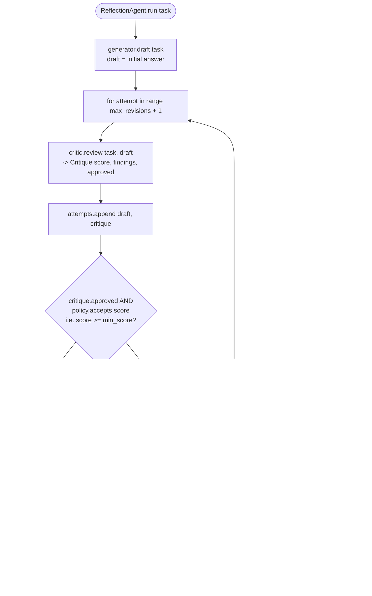

# Architecture Decision Record: Reflection Agent Pattern

## Context

Accuracy-critical AI workflows need more than a better prompt. Code generation, technical writing, policy analysis, regulated content, executive reporting — all benefit from an explicit review loop, where one output gets critiqued against quality criteria before it ships.

## Decision

This repo implements Reflection as a generator-critic-reviser system:

1. `Generator.draft` creates the first answer.
2. `Critic.review` scores the answer and returns actionable findings.
3. `QualityPolicy` decides whether the answer is acceptable.
4. `Generator.revise` improves the answer using critique.
5. `ReflectionAgent` owns the loop limit and finalization behavior.

I split the critic out as a separate interface from the generator. In production, that critic could be a stronger model, a cheaper model with strict rubrics, a rules engine, static analysis, a retrieval-grounded verifier, a human reviewer — or some blend of those.

## When To Use

Use Reflection when correctness and polish are more important than lowest latency:

- Code generation and code review.
- Content validation and editing.
- High-stakes reasoning.
- Requirements and architecture documents.
- Customer-facing communication that must be checked before delivery.

Avoid Reflection for simple tool lookup where a ReAct loop is cheaper and easier to observe.

## Runtime Flow

```text
Task
  -> initial draft
  -> critique with score and findings
  -> accept if threshold passes
  -> revise and review again until budget is exhausted
```

The diagram below traces the exact control flow implemented in `ReflectionAgent.run()` (`src/reflection_agent_pattern/reflection.py`), including the bound on total attempts and the two ways the loop can end:



Two real exit paths, both present in `reflection.py`:

- **Accepted** — `critique.approved` is `True` and `policy.accepts(critique.score)` passes the `min_score` bar (default `0.85`); the loop returns immediately with that draft (green).
- **Budget exhausted** — the loop runs `policy.max_revisions + 1` attempts (default `2 + 1 = 3`: one initial draft-and-review plus up to 2 revise-and-review passes) without ever getting an approved, above-threshold draft; it returns the *last* draft as `answer` with `attempts` showing the full, honest history — there is no silent "treat the last try as a pass" fallback (amber).

### Benchmark: reflection's quality lift is now measured, not just claimed

The "Reflection improves quality" claim above used to be prose-only. It is now backed by a real, executed benchmark: `scripts/benchmark_reflection_delta.py` runs 11 deterministic tasks through the actual `ReflectionAgent.run()` loop and the actual `QualityPolicy` stop condition, scoring every attempt with the same critic the agent itself uses to decide when to stop — so `first_score` (`attempts[0].critique.score`) is what draft-only would have shipped, and `final_score` (`attempts[-1].critique.score`) is what the loop produced. No LLM calls; `Generator`/`Critic` are hand-written deterministic stubs in the same style as `ScriptedGenerator`/`ScriptedCritic`.

Headline result (from [`docs/receipts/benchmark.md`](receipts/benchmark.md), generated by re-running the script): **mean score delta of +0.2673** across the 11 tasks, with **8/11 (72.7%) improved** by reflection and **9/11 (81.8%) approved within the revision budget**. The 3 already-passing tasks correctly show a `+0.0000` delta (reflection does not manufacture improvement where the first draft already clears the bar), and the 2 adversarial tasks — where the generator structurally cannot supply one required marker (e.g. an external sign-off) — correctly exhaust the revision budget without approval rather than being silently rubber-stamped. See `docs/receipts/benchmark.md` for the full per-task table and methodology, and the README status table for the CI gate against `golden-eval-registry`.

## State Model

Each attempt stores the draft and critique. In production, I'd persist:

- Prompt and model metadata.
- Critique rubric version.
- Score, findings, and approval decision.
- Revision lineage.
- Human override decisions.

Do not persist hidden chain-of-thought. Persist summarized critique and explicit evidence instead.

## Guardrails

- Minimum score threshold.
- Maximum revision count.
- Structured critique object.
- Separate approval from score so policy can include hard-fail rules.

Recommended production additions:

- Rubric-specific evaluators.
- Regression suites with golden tasks.
- Static analyzers for generated code.
- Factuality checks against retrieval sources.
- Human review queue when scores remain low after retries.

## Failure Modes

- Critic leniency: the reviewer approves weak output. Mitigation: calibrate against human-labeled examples.
- Critic overfitting: the generator learns to satisfy rubric wording without solving the task. Mitigation: rotate rubrics and use task-specific evidence checks.
- Latency amplification: every revision adds model calls. Mitigation: use Reflection only on workflows where quality economics justify it.
- Infinite refinement pressure: models keep changing acceptable answers. Mitigation: threshold plus revision cap.

## Scaling Strategy

Run Reflection inline for short-form tasks. For heavier work, move critique and revision to asynchronous jobs with resumable state. Use score distributions and finding categories as product telemetry: they reveal where prompts, tools, or source data are weak.

## Success Metrics

- Pass rate after first draft.
- Pass rate after revision.
- Human acceptance rate.
- Defect escape rate.
- Average revisions per task.
- Cost per accepted answer.

